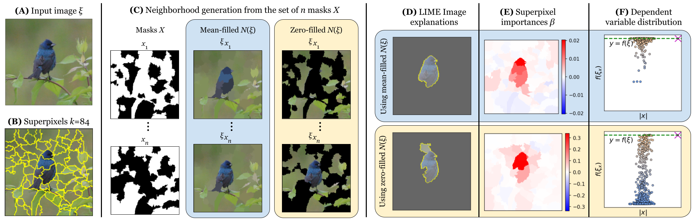

<h1> Using Stratified Sampling to Improve LIME Image Explanations </h1>


- This repository contains the changes needed to add the stratified sampling strategy to the original codebase of LIME proposed for the Research Article <a href='https://doi.org/10.1609/aaai.v38i13.29397'>'<b>Using Stratified Sampling to Improve LIME Image Explanations</b>'. </a>  published at <a href='https://ojs.aaai.org/index.php/AAAI/index'> Proceedings of the AAAI Conference on Artificial Intelligence. </a>

- The rest of Experiments for the proposed strategy are uploaded here at <b><a href='https://github.com/rashidrao-pk/lime-stratified-examples'> LIME Stratified Examples </a></b>

## Installation

The lime_stratified package is on **[PyPI](https://pypi.org/project/lime-stratified/)**, Simply run:

```sh
pip install lime_stratified
```
alternatively, it can also be installed using:
```sh
pip install git+https://github.com/rashidrao-pk/lime_stratified.git
```

Or clone the repository and run:

```sh
git clone https://github.com/rashidrao-pk/lime_stratified
cd lime_stratified
python setup.py install
```

### How to use ?

- The class `LimeImageExplainer` adds a single parameter `use_stratification` to the `explain_instance` method. When the parameter is False, the code behaves exactly like the original LIME implementation. When `use_stratification=True` the algorithm *StratifiedSampling* is used, as described in the paper.

```python
# Code example
from lime_stratified.lime import lime_image
lime_explainer = lime_image.LimeImageExplainer(random_state=1234)
explanation = lime_explainer.explain_instance(image_to_explain,
                                              blackbox_model,
                                              use_stratification=True)
```

## Paper PDF:
**Using Stratified Sampling to Improve LIME Image Explanations** can be found at [LINK](https://ojs.aaai.org/index.php/AAAI/article/view/29397) and also on <a href=''> <a href = 'https://arxiv.org/abs/2403.17742'>  </a>
</a>.

# Cite
If you use our proposed strategy, please cite us: <br>
``` 
@inproceedings{rashid2024using,
  title={Using Stratified Sampling to Improve LIME Image Explanations},
  author={Rashid, Muhammad and Amparore, Elvio G and Ferrari, Enrico and Verda, Damiano},
  booktitle={Proceedings of the AAAI Conference on Artificial Intelligence},
  volume={38},
  number={13},
  pages={14785--14792},
  year={2024}
}
```
<br>
The remaining part of this readme is the original redme file of LIME.

# LIME_Stratified


[](https://app.codacy.com/gh/rashidrao-pk/lime_stratified?utm_source=github.com&utm_medium=referral&utm_content=rashidrao-pk/lime_stratified&utm_campaign=Badge_Grade)
[](https://mybinder.org/v2/gh/rashidrao-pk/lime_stratified/HEAD)


This project is about explaining what machine learning classifiers (or models) are doing.
At the moment, we support explaining individual predictions for text classifiers or classifiers that act on tables (numpy arrays of numerical or categorical data) or images, with a package called lime (short for local interpretable model-agnostic explanations based on **stratification approach**).

LIME_Stratified is based on the work presented in [this paper](https://doi.org/10.1609/aaai.v38i13.29397) ([bibtex here for citation](https://github.com/rashidrao-pk/lime_stratified/blob/master/citation.bib)). Here is a link to the promo video:

<a href="https://www.youtube.com/watch?v=hUnRCxnydCc" target="_blank"></a>

Our plan is to add more packages that help users understand and interact meaningfully with machine learning.

Lime is able to explain any black box classifier, with two or more classes. All we require is that the classifier implements a function that takes in raw text or a numpy array and outputs a probability for each class. Support for scikit-learn classifiers is built-in.

We dropped python2 support in `0.2.0`, `0.1.1.37` was the last version before that.


## Tutorials and API

For example usage for text classifiers, take a look at the following two tutorials (generated from ipython notebooks):

- [Basic usage, two class. We explain random forest classifiers.](https://marcotcr.github.io/lime/tutorials/Lime%20-%20basic%20usage%2C%20two%20class%20case.html)
- [Multiclass case](https://marcotcr.github.io/lime/tutorials/Lime%20-%20multiclass.html)

For classifiers that use numerical or categorical data, take a look at the following tutorial (this is newer, so please let me know if you find something wrong):

- [Tabular data](https://marcotcr.github.io/lime/tutorials/Tutorial%20-%20continuous%20and%20categorical%20features.html)
- [Tabular data with H2O models](https://marcotcr.github.io/lime/tutorials/Tutorial_H2O_continuous_and_cat.html)
- [Latin Hypercube Sampling](doc/notebooks/Latin%20Hypercube%20Sampling.ipynb)

For image classifiers:

- [Images - basic](https://marcotcr.github.io/lime/tutorials/Tutorial%20-%20images.html)
- [Images - Faces](https://github.com/marcotcr/lime/blob/master/doc/notebooks/Tutorial%20-%20Faces%20and%20GradBoost.ipynb)
- [Images with Keras](https://github.com/marcotcr/lime/blob/master/doc/notebooks/Tutorial%20-%20Image%20Classification%20Keras.ipynb)
- [MNIST with random forests](https://github.com/marcotcr/lime/blob/master/doc/notebooks/Tutorial%20-%20MNIST%20and%20RF.ipynb)
- [Images with PyTorch](https://github.com/marcotcr/lime/blob/master/doc/notebooks/Tutorial%20-%20images%20-%20Pytorch.ipynb)

For regression:

- [Simple regression](https://marcotcr.github.io/lime/tutorials/Using%2Blime%2Bfor%2Bregression.html)

Submodular Pick:

- [Submodular Pick](https://github.com/marcotcr/lime/tree/master/doc/notebooks/Submodular%20Pick%20examples.ipynb)

The raw (non-html) notebooks for these tutorials are available [here](https://github.com/marcotcr/lime/tree/master/doc/notebooks).

The API reference is available [here](https://lime-ml.readthedocs.io/en/latest/).

### How LIME_Image Works?



## Contributing

Please read [this](CONTRIBUTING.md).
